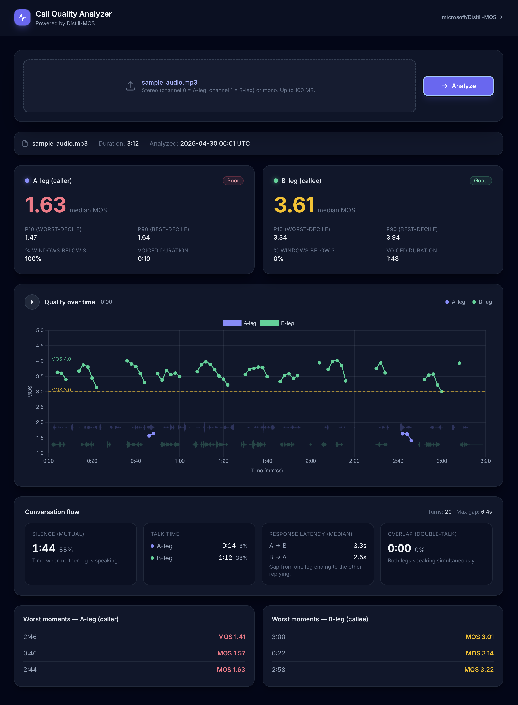

# Call Quality Analyzer



A small FastAPI + HTMX web app that scores **FreeSWITCH stereo WAV recordings**
with Microsoft's [Distill-MOS](https://github.com/microsoft/Distill-MOS)
speech-quality model and
[Silero VAD](https://github.com/snakers4/silero-vad) for voice activity
detection. Channel 0 is treated as the **A-leg** (caller), channel 1 as the
**B-leg** (callee). Each leg is windowed (8 s window / 2 s hop), VAD-gated, and
scored independently.

The result page shows median / P10 / P90 MOS per leg with a quality status
badge (Excellent / Good / Fair / Poor), the fraction of windows below 3.0 MOS,
voiced duration, a quality-over-time chart with synchronized audio playback
and a stacked waveform overlay, conversation-flow metrics (mutual silence,
talk-time split, median response latency per direction, double-talk overlap),
and the worst moments per leg with timestamps.

## Install

Managed with [`uv`](https://docs.astral.sh/uv/) — installs Python, creates the
project venv, and resolves the lockfile in one step.

```bash
# One-time, if you don't have uv:
curl -LsSf https://astral.sh/uv/install.sh | sh

# Inside this repo:
uv sync
```

> The first model invocation downloads the Distill-MOS weights automatically
> (a few hundred MB). Subsequent boots are fast.

> Common workflows are also wrapped in the `Makefile` — run `make` to list
> targets (`install`, `dev`, `run`, `health`, `lint`, `format`,
> `docker-build`, `docker-run`).

## Run

```bash
uv run uvicorn main:app --reload
```

Open http://127.0.0.1:8000 in your browser. No need to activate a venv — `uv
run` resolves and uses the project environment automatically.

- `GET /` &mdash; upload UI
- `GET /health` &mdash; returns `{"status":"ok"}` once both models are loaded
- `POST /analyze` &mdash; multipart upload of a stereo WAV; returns an HTMX
  progress partial that polls `/progress/{job_id}` until the analysis
  completes and swaps the result into `#results`
- `GET /progress/{job_id}` &mdash; HTMX-polled progress fragment; returns the
  final result partial when the job is done
- `GET /audio/{job_id}` &mdash; streams the uploaded audio back so the result
  page can play it inline (kept in memory, expires after 10 min)

### Run with Docker

```bash
make docker-build      # builds call-quality-analyzer:latest
make docker-run        # runs it on http://127.0.0.1:8000
```

Or invoke `docker build` / `docker run` directly — see the `Dockerfile` and
`Makefile` for details.

## Notes

- Uploads are kept in process memory only so the result page can replay the
  audio; jobs and their audio are dropped 10 minutes after creation
  (`JOB_TTL_S` in `main.py`). Nothing is written to disk.
- Maximum upload size is 100 MB. Anything larger renders a friendly error card.
- The Distill-MOS and Silero VAD models are loaded **once** at server startup
  via FastAPI's `lifespan` and reused for every request. Inference runs under
  `torch.no_grad()` with the model in `eval()` mode.
